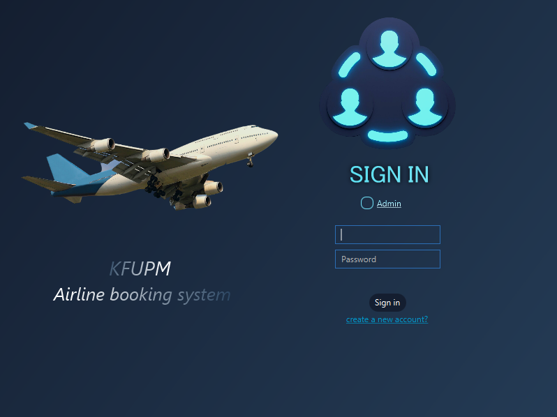
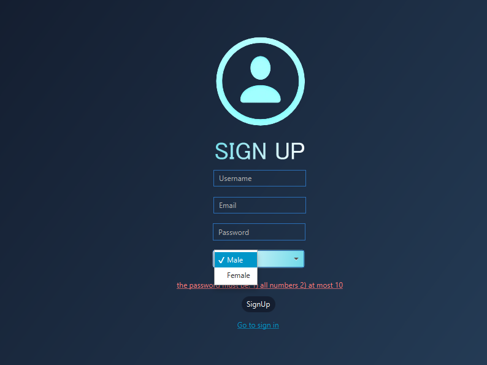
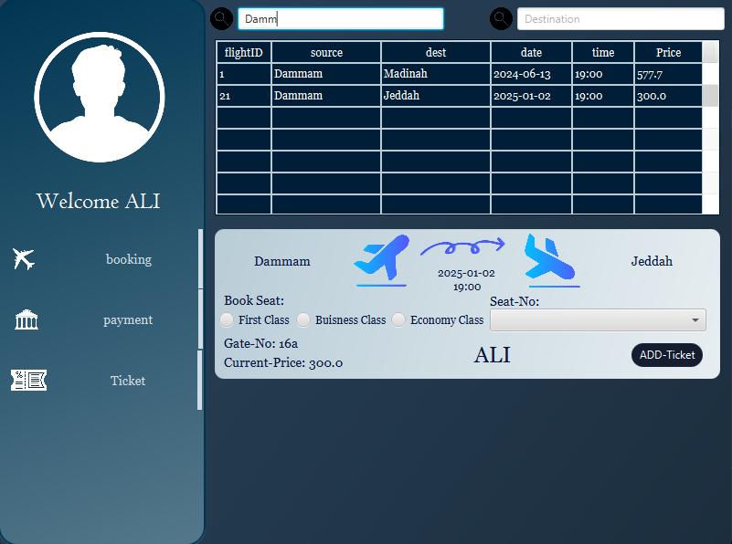
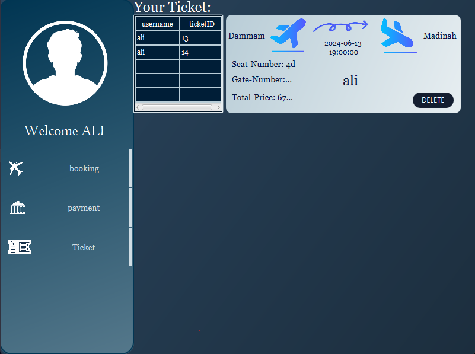
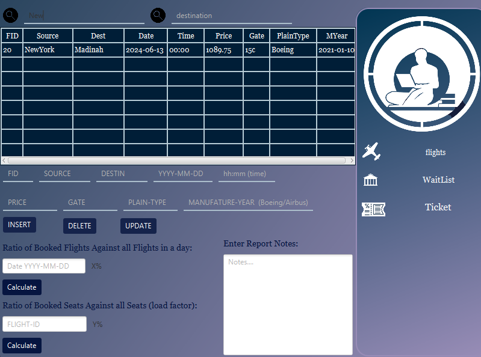
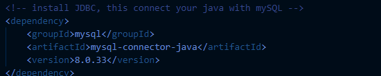

# Flight Booking Management System

## Overview
This is a JavaFX-based flight booking management system that allows users to book flights, manage seats, and handle payments. The application has separate interfaces for regular users and administrators.



## Features

### User Features
- User authentication (login/signup)


- Browse/Filter available flights by source and destination
- Book seats with different class options (First Class, Business Class, Economy Class)

- View and manage tickets + (Cancel bookings)


### Admin Features
- Manage flights (add, update, delete)
- Manage tickets
- View booking statistics
- Handle waitlists
- Monitor seat availability



## System Requirements
- Java 8 or higher
- JavaFX
- MySQL database
- JDBC library:
    - 

## Database Setup
1. Install MySQL server
2. import the database named "project-database-javafx" [Download Folder](dumps/project-database-javafx)
3. Update the database connection details in `JDBC.java`:
   ```java
   static String url = "jdbc:mysql://localhost:3306/project";
   static String username = "root"; / change this with your mySQL username
   static String password = "1234"; / change this with your mySQL password
